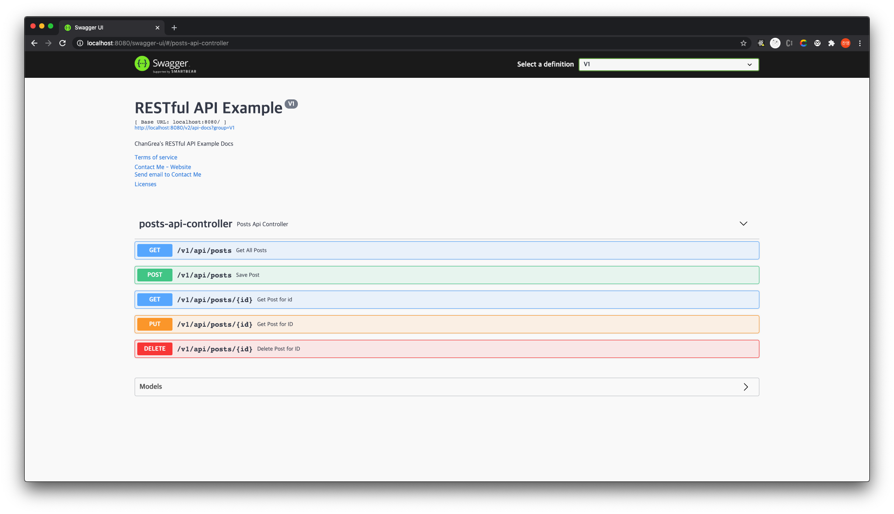

# RESTful API Example

> Spring Boot와 JPA를 활용하여 만든 RESTful API 서버.
>
> 본 Repository는 간단한 Domain-Driven Design과 AOP를 적용했지만, 이런 구조나 서비스적인 부분보다는  `RESTful`하게 API를 만드는데 집중하였다.


## Environment

- Spring Boot **2.3.3.RELEASE**
- Spring Data JPA
- Spring HATEOAS
- Gradle **5.6.4**
- H2 Database
- Swagger **3.0.0**
- Lombok


## Folder Structure

```
src
├── main
│   ├── java
│   │   └── io
│   │       └── changrea
│   │           └── restapiexample
│   │               ├── RestapiexampleApplication.java
│   │               ├── aspect
│   │               │   ├── ControllerLoggingAspect.java
│   │               │   └── ServiceLoggingAspect.java
│   │               ├── config
│   │               │   ├── ModelMapperConfig.java
│   │               │   └── SwaggerConfig.java
│   │               ├── domain
│   │               │   ├── BaseTimeEntity.java
│   │               │   └── posts
│   │               ├── service
│   │               │   └── PostsService.java
│   │               └── web
│   │                   ├── HelloController.java
│   │                   ├── PostsApiController.java
│   │                   └── dto
│   └── resources
│       └── application.properties
└── test
    └── java
        └── io
            └── changrea
                └── restapiexample
                    ├── RestapiexampleApplicationTests.java
                    ├── domain
                    │   └── posts
                    └── web
                        ├── HelloControllerTest.java
                        └── PostsApiControllerTest.java
```

### aspect (/src/main/java/io/changrea/restapiexample/aspect)

- Logging for Controller, Service classes


### config (/src/main/java/io/changrea/restapiexample/config)

- Config for ModelMapper, Swagger


### domain (/src/main/java/io/changrea/restapiexample/domain)

- Entity
- DAOs


### service (/src/main/java/io/changrea/restapiexample/service)

- Service classes


### web (/src/main/java/io/changrea/restapiexample/web)

- DTOs
- Controller class


### test (/src/test)

- Test code for API


## Swagger & RESTful API

- [http://localhost:8080/swagger-ui/](http://localhost:8080/swagger-ui/)



### :heavy_check_mark: Get All Posts

모든 포스트를 가져옵니다.

#### Request

```bash
curl -X GET "http://localhost:8080/v1/api/posts" -H "accept: */*"
```


#### Response

```json
{
  "_embedded": {
    "posts": [
      {
        "id": 1,
        "title": "string",
        "content": "string",
        "author": "string"
      }
    ]
  },
  "_links": {
    "self": {
      "href": "http://localhost:8080/v1/api/posts"
    }
  }
}
```


### :heavy_check_mark: Save Post

포스트를 저장합니다.

#### Request

```bash
curl -X POST "http://localhost:8080/v1/api/posts" -H "accept: */*" -H "Content-Type: application/json" -d "{ \"author\": \"string\", \"content\": \"string\", \"title\": \"string\"}"
```


#### Response

```json
{
  "content": 1,
  "_links": {
    "self": {
      "href": "http://localhost:8080/v1/api/posts"
    },
    "get": {
      "href": "http://localhost:8080/v1/api/posts"
    },
    "update": {
      "href": "http://localhost:8080/v1/api/posts"
    },
    "delete": {
      "href": "http://localhost:8080/v1/api/posts"
    }
  }
}
```


### :heavy_check_mark: Get Post for id

포스트를 가져옵니다.

#### Request

```bash
curl -X GET "http://localhost:8080/v1/api/posts/1" -H "accept: */*"
```


#### Response

```json
{
  "id": 1,
  "title": "string",
  "content": "string",
  "author": "string",
  "_links": {
    "self": {
      "href": "http://localhost:8080/v1/api/posts/1"
    },
    "update": {
      "href": "http://localhost:8080/v1/api/posts/1"
    },
    "delete": {
      "href": "http://localhost:8080/v1/api/posts/1"
    }
  }
}
```


### :heavy_check_mark: Update Post for id

포스트를 수정합니다.

#### Request

```bash
curl -X PUT "http://localhost:8080/v1/api/posts/1" -H "accept: */*" -H "Content-Type: application/json" -d "{ \"content\": \"string\", \"title\": \"string\"}"
```


#### Response

```json
{
  "content": 1,
  "_links": {
    "self": {
      "href": "http://localhost:8080/v1/api/posts/1"
    },
    "get": {
      "href": "http://localhost:8080/v1/api/posts/1"
    },
    "delete": {
      "href": "http://localhost:8080/v1/api/posts/1"
    }
  }
}
```


### :heavy_check_mark: Delete Post for id

포스트를 삭제합니다.

#### Request

```bash
curl -X DELETE "http://localhost:8080/v1/api/posts/1" -H "accept: */*"
```


#### Response

```json
{
  "content": true,
  "_links": {
    "self": {
      "href": "http://localhost:8080/v1/api/posts/1"
    }
  }
}
```


## Reference

### RESTful API와 설계 원칙

- [https://changrea.io/Web/rest-api/](https://changrea.io/Web/rest-api/)
- [https://changrea.io/Web/rest-api-design-1/](https://changrea.io/Web/rest-api-design-1/)
- [https://changrea.io/Web/rest-api-design-2/](https://changrea.io/Web/rest-api-design-2/)

### Spring Boot 서비스 개발

- [http://www.yes24.com/Product/Goods/83849117](http://www.yes24.com/Product/Goods/83849117)

